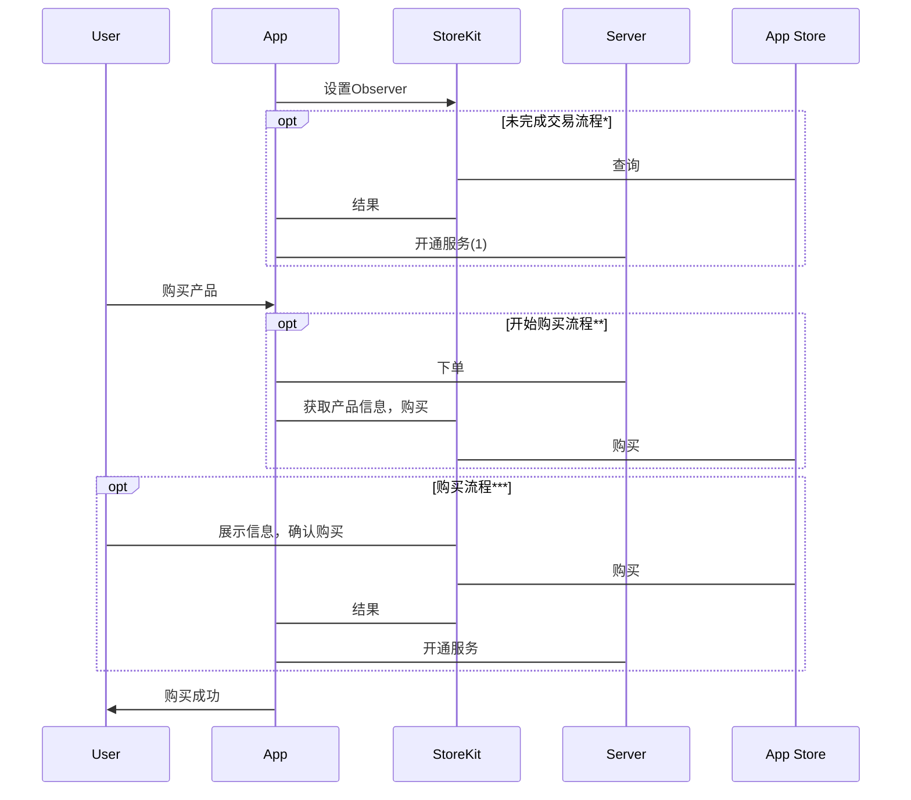
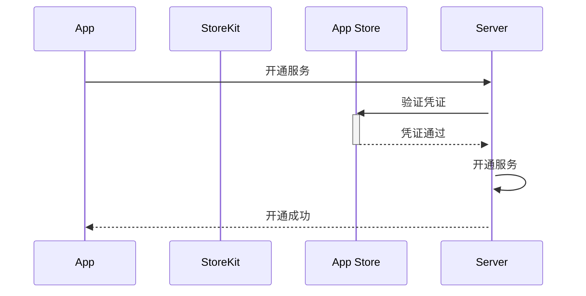
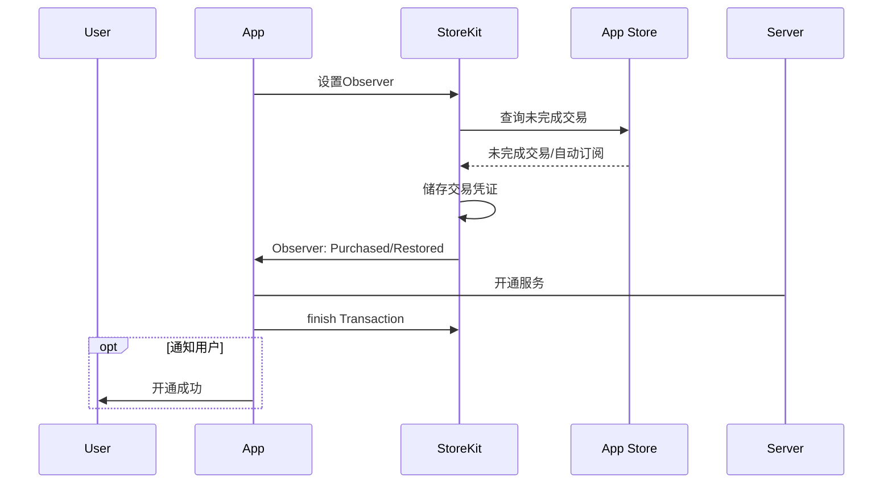
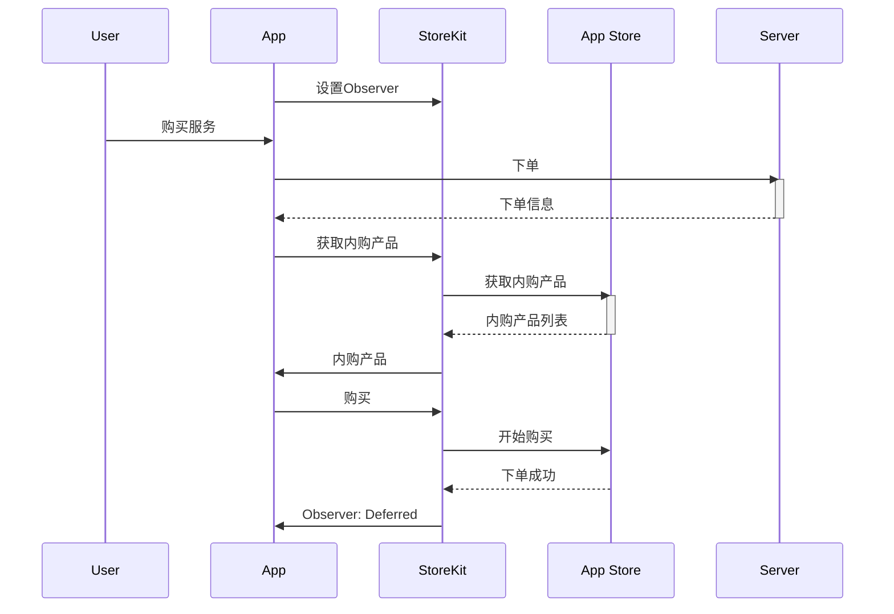
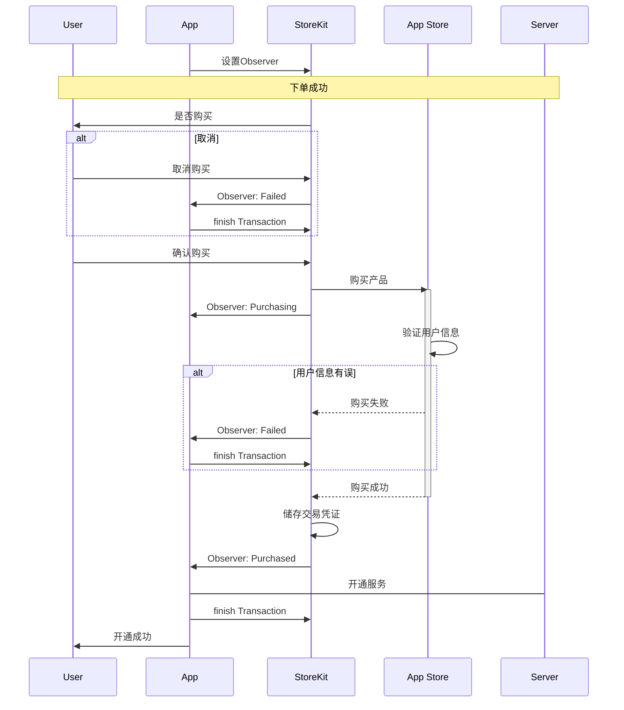
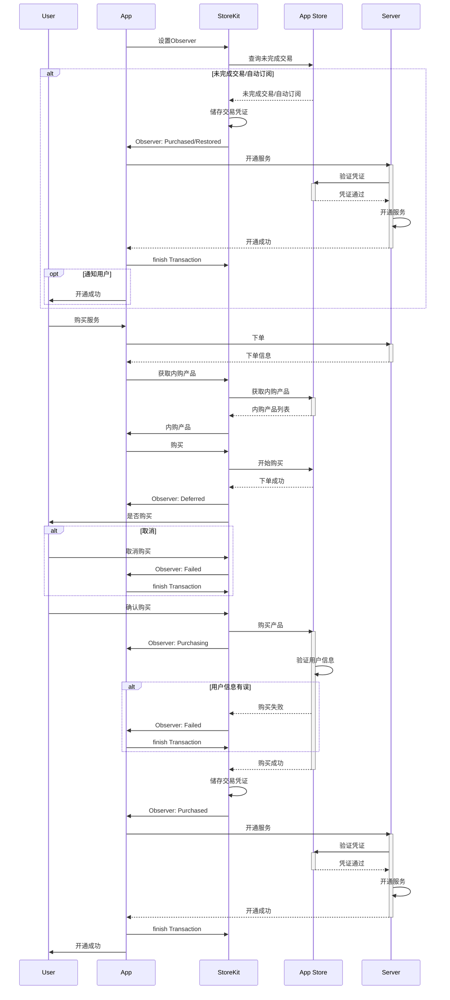

 
 
 [toc]
 

## 流程


### 精简流程


### 开通服务流程



### 未完成交易流程


### 开始购买流程


### 购买流程


### 总流程



<!-- more -->


### 获取产品信息列表
```objc
NSSet *identifiers = [NSSet setWithObject:productIdentifier];
self.productRequest = [[SKProductsRequest alloc] initWithProductIdentifiers:identifiers];
self.productRequest.delegate = self;
[self.productRequest start];

//SKProductsRequest 强引用，保持在回调期间存活
```

### 判断是否开启IAP
```objc
[SKPaymentQueue canMakePayments]
```
### 设置内购监听
```objc 
[[SKPaymentQueue defaultQueue] addTransactionObserver:self];

//移除监听
[[SKPaymentQueue defaultQueue] removeTransactionObserver:self];

```


### 发起购买
```objc
SKMutablePayment *payment = [SKMutablePayment paymentWithProduct:self.validProduct];
//设置购买用户标示
payment.applicationUsername = self.orderId;
[[SKPaymentQueue defaultQueue] addPayment:payment];
```


### 交易完成
```objc
[[SKPaymentQueue defaultQueue] finishTransaction:transaction];
```

### 验签(可放在服务器)
```objc
// 验证凭据，获取到苹果返回的交易凭据
// appStoreReceiptURL iOS7.0增加的，购买交易完成后，会将凭据存放在该地址
NSURL *receiptURL = [[NSBundle mainBundle] appStoreReceiptURL];
// 从沙盒中获取到购买凭据
NSData *receiptData = [NSData dataWithContentsOfURL:receiptURL];
//发送POST请求，对购买凭据进行验证
//测试验证地址：https://sandbox.itunes.apple.com/verifyReceipt
//正式验证地址：https://buy.itunes.apple.com/verifyReceipt
NSURL *url = [NSURL URLWithString:AppStore_URL];
NSMutableURLRequest *urlRequest = [NSMutableURLRequest requestWithURL:url cachePolicy:NSURLRequestUseProtocolCachePolicy timeoutInterval:15.0f];
urlRequest.HTTPMethod = @"POST";
NSString *encodeStr = [receiptData base64EncodedStringWithOptions:NSDataBase64EncodingEndLineWithLineFeed];
_receipt = encodeStr;
NSString *payload = [NSString stringWithFormat:@"{\"receipt-data\" : \"%@\"}", encodeStr];
NSData *payloadData = [payload dataUsingEncoding:NSUTF8StringEncoding];
urlRequest.HTTPBody = payloadData;

NSData *result = [NSURLConnection sendSynchronousRequest:urlRequest returningResponse:nil error:nil];

if (result == nil) {
    NSLog(@"验证失败");
    return;
}

```


## Apple 验签结果

```swift
{
environment = Sandbox;
receipt =     {
    "adam_id" = 0;
    "app_item_id" = 0;
    "application_version" = "1.0";
    "bundle_id" = "com.baihe.online";
    "download_id" = 0;
    "in_app" =         (
        {
            "is_trial_period" = false;
            "original_purchase_date" = "2018-12-12 12:30:55 Etc/GMT";
            "original_purchase_date_ms" = 1544617855000;
            "original_purchase_date_pst" = "2018-12-12 04:30:55 America/Los_Angeles";
            "original_transaction_id" = 1000000486406371;
            "product_id" = "com.baihe.online.zuan.12.live";
            "purchase_date" = "2018-12-12 12:30:55 Etc/GMT";
            "purchase_date_ms" = 1544617855000;
            "purchase_date_pst" = "2018-12-12 04:30:55 America/Los_Angeles";
            quantity = 1;
            "transaction_id" = 1000000486406371;
        },
        {
            "is_trial_period" = false;
            "original_purchase_date" = "2018-12-13 02:18:12 Etc/GMT";
            "original_purchase_date_ms" = 1544667492000;
            "original_purchase_date_pst" = "2018-12-12 18:18:12 America/Los_Angeles";
            "original_transaction_id" = 1000000486664745;
            "product_id" = "com.baihe.online.xindong.3.78.live";
            "purchase_date" = "2018-12-13 02:18:12 Etc/GMT";
            "purchase_date_ms" = 1544667492000;
            "purchase_date_pst" = "2018-12-12 18:18:12 America/Los_Angeles";
            quantity = 1;
            "transaction_id" = 1000000486664745;
        }
    );
    "original_application_version" = "1.0";
    "original_purchase_date" = "2013-08-01 07:00:00 Etc/GMT";
    "original_purchase_date_ms" = 1375340400000;
    "original_purchase_date_pst" = "2013-08-01 00:00:00 America/Los_Angeles";
    "receipt_creation_date" = "2018-12-13 02:42:52 Etc/GMT";
    "receipt_creation_date_ms" = 1544668972000;
    "receipt_creation_date_pst" = "2018-12-12 18:42:52 America/Los_Angeles";
    "receipt_type" = ProductionSandbox;
    "request_date" = "2018-12-13 02:42:58 Etc/GMT";
    "request_date_ms" = 1544668978007;
    "request_date_pst" = "2018-12-12 18:42:58 America/Los_Angeles";
    "version_external_identifier" = 0;
};
status = 0;
}

```

## 交易回调
1. 内购成功之后 -> 回调
2. 存在未结束交易
    * App卸载，再安装 -> 不回调
    * 注册监听 -> 回调
    * 手机重启 -> 
    * App重装 -> 回调

## FAQ
### [invalid-product-ids](http://troybrant.net/blog/2010/01/invalid-product-ids/)

* Have you enabled In-App Purchases for your App ID?
* Have you checked Cleared for Sale for your product?
* Have you submitted (and optionally rejected) your application binary?
* Does your project’s .plist Bundle ID match your App ID?
* Have you generated and installed a new provisioning profile for the new App ID?
* Have you configured your project to code sign using this new provisioning profile?
* Are you building for iPhone OS 3.0 or above?
* Are you using the full product ID when when making an SKProductRequest?
* Have you waited several hours since adding your product to iTunes Connect?
* Are your bank details active on iTunes Connect? (via Mark)
* Have you tried deleting the app from your device and reinstalling? (via Hector, S3B, Alex O, Joe, and Alberto)
* Is your device jailbroken? If so, you need to revert the jailbreak for IAP to work. (via oh my god, Roman, and xfze)

### [IAP 订单绑定](https://www.jianshu.com/p/847838cde48b)
目前无解

### 沙盒
自动订阅触发： 5min

### 错误状态
#### 21002
https://forums.developer.apple.com/message/129490#129490
https://forums.developer.apple.com/thread/47218

## 参考
[真·iOS内购的完整流程](https://www.jianshu.com/p/d90aeca518a8)
[iOS 苹果内购详细步骤](https://blog.csdn.net/qq_22080737/article/details/79786500)
[In-App Purchase Programming Guide](https://developer.apple.com/library/archive/documentation/NetworkingInternet/Conceptual/StoreKitGuide/Introduction.html#//apple_ref/doc/uid/TP40008267-CH1-SW1)


