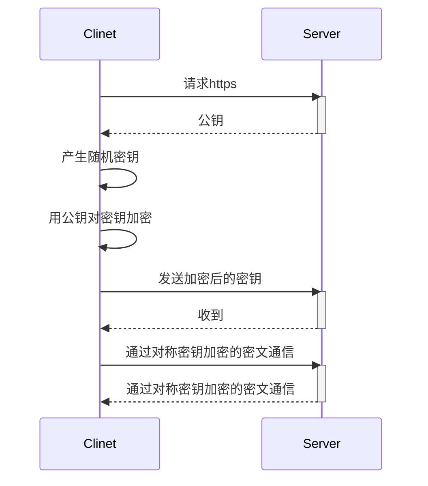

[TOC]

### 概述
HTTPS(HTTP over TLS)是一种通过计算机网络进行安全通信的传输协议。HTTPS经由HTTP进行通信，但利用SSL/TLS来加密数据包。这个协议由 **网景公司(Netscape)** 在1994年首次提出，随后扩展到互联网上。

在OSI七层网络模型中HTTP位于第七层 **应用层** ，TLS位于第五层 **会话层** `(记录协议SSL Record Protocol)`和第六层**表示层**`(握手协议SSL Handshake Protocol)`。

### 通信

在TLS握手协议中公钥对数据加密`(非对称加密)`，换取对称加密密钥，最终信息将会被对称加密密钥加密传输`(对称加密)`。



<!-- more -->

为了防止TLS在握手也协议中的公钥被篡改，又诞生了证书颁发机构，证书颁发机构对加密的公钥签名(域名)，握手协议中会对公钥的合法性(签名,域名)进行验证。


### Let's Encrypt
Let's Encrypt是一个于2015年三季度推出的数字证书认证机构，旨在以自动化流程消除手动创建和安装证书的复杂流程，并推广使万维网服务器的加密连接无所不在，为安全网站提供免费的SSL/TLS证书。

用以实现新的数字证书认证机构的协议被称为自动证书管理环境（ACME）

2018年1月支持通配符证书。


### [acme.sh](https://github.com/Neilpang/acme.sh)
acme.sh是实现ACME协议的脚本工具。可以从 letsencrypt 生成免费的证书。

#### 安装
```shell
$ curl  https://get.acme.sh | sh
```

#### 生成证书
```shell

# DP_Id,DP_Key 调用DNS服务商API的TOKEN
export DP_Id="49824"
export DP_Key="394f8762a1232cf5aad40fc2d5c0dabb"
acme.sh --issue --dns dns_dp -d foo.com -d *.foo.com
```

签发成功后，就会给出 CSR、KEY、CERT 保存的路径 /root/.acme.sh/foo.com/中

#### copy/安装证书
```shell
acme.sh --installcert -d  foo.com   \
--key-file  /etc/nginx/ssl/<domain>.key \
--fullchain-file /etc/nginx/ssl/fullchain.cer \
--reloadcmd  "service nginx force-reload"
```

值得注意的是, 这里指定的所有参数都会被自动记录下来, 并在将来证书自动更新以后, 被再次自动调用.

#### 更新证书
目前证书在 60 天以后会自动更新

## 参考
[超文本传输安全协议](https://zh.wikipedia.org/wiki/%E8%B6%85%E6%96%87%E6%9C%AC%E4%BC%A0%E8%BE%93%E5%AE%89%E5%85%A8%E5%8D%8F%E8%AE%AE)
[Let's Encrypt](https://zh.wikipedia.org/wiki/Let%27s_Encrypt)
[SSL协议到底工作在OSI模型中的那一层？](https://blog.csdn.net/Better2326/article/details/48371241)
[acme.sh说明](https://github.com/Neilpang/acme.sh/wiki/%E8%AF%B4%E6%98%8E)
[腾讯云DNSPod API申请Let’s Encrypt泛域名证书](https://cloud.tencent.com/developer/article/1064471)
