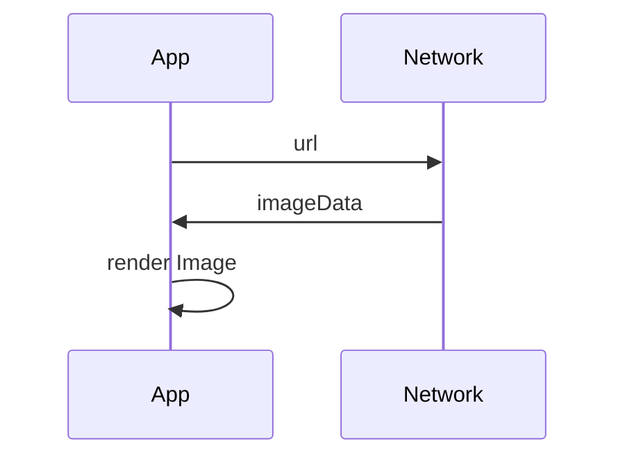
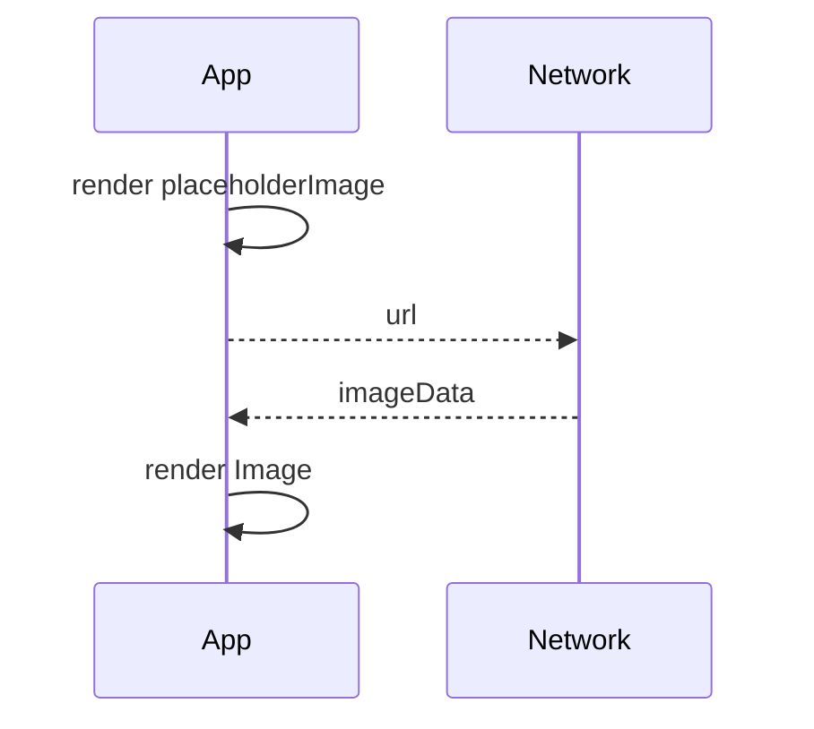
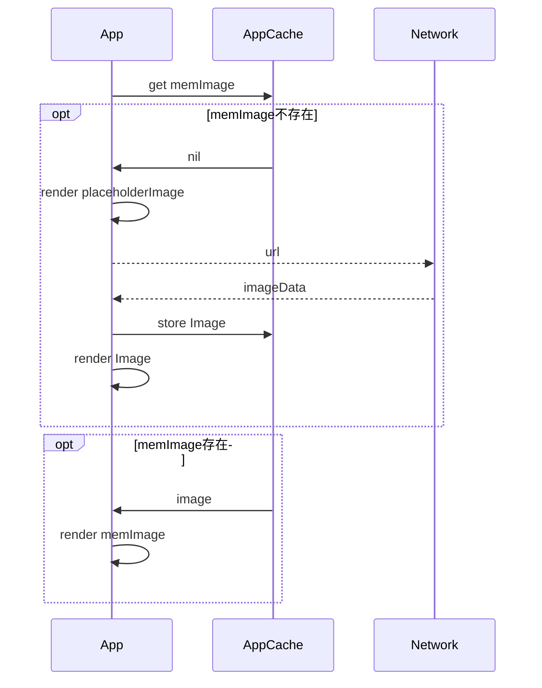
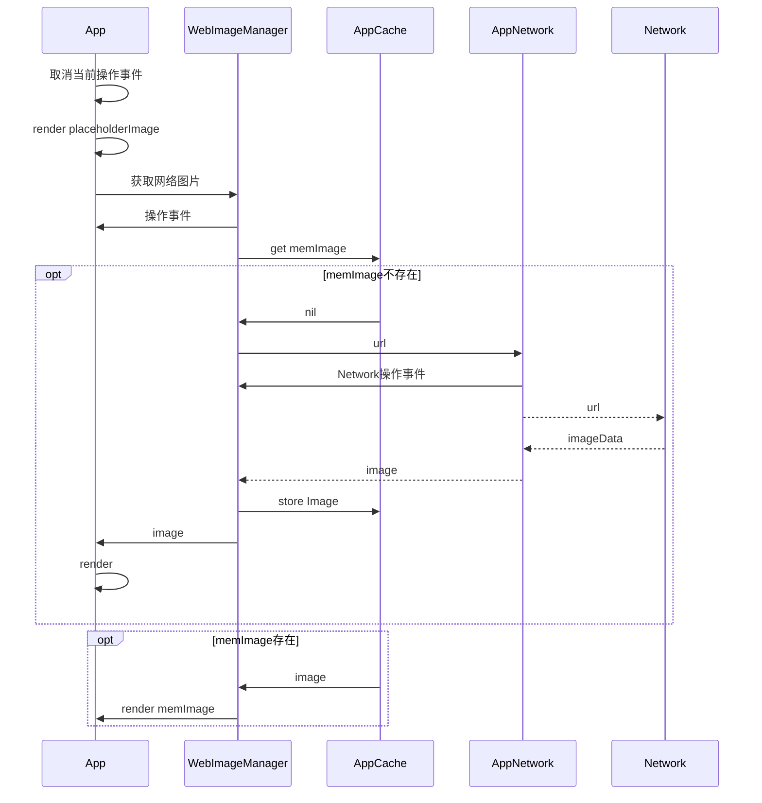

[toc]

## YLWebImage V1.0




### 更新日志
1. 网络图片功能实现🎉
2. 完美兼容iOS7以上系统

```swift
let url:URL = <image_url>
if let imageData = try? Data(contentsOf: url)  {
    self.imageView.image = UIImage(data: imageData)
}
```

### FAQ
1. ‘框架’如何接入？
不用接入，也没法接入，每个地方这么写就成了

### issue列表
1. 每次都写这三段代码，不够优雅
2. 加载多张图片的时候直接卡死

<!-- more -->

## YLWebImage V1.1



### 更新日志
1. 设置网络图片更方便🎉
2. 🚀重大升级，支持异步加载图片，让你的用户在漫长的等待中也能操作
3. 🚀重大升级，支持设置placehoder，避免你的app一开始的时候一片空白


```swift
//分类
extension UIImageView {
    func yl_setImage(url: URL?, placeholderImage: UIImage?) -> Void  {
        self.image = placeholderImage
        guard let imageUrl = url else {
            return
        }
        let dispatch = DispatchQueue.global()
        dispatch.async {
            if let imageData = try? Data(contentsOf: imageUrl) {
                DispatchQueue.main.async {
                    self.image = UIImage(data: imageData)
                }
            }
        }
    }
}

//使用
self.imageView.yl_setImage(url: url, placeholderImage: UIImage(named: "placeholder"))
```

### FAQ
1. 有没有缓存机制
代码如上，没有任何缓存机制（内存，磁盘），重复大量的网络图片加载慎用

### issue列表
1. 每次设置都会强制显示占位图片
2. 使用‘框架’后，用户的流量消耗陡增

## YLWebImage V1.2



### 更新日志
1. 🚀重大升级，支持缓存（内存），大量节省用户流量
2. 内存占有会有一点点高😅

```swift
//新增缓存类
class YLImageCache {
    //单例
    static let `default` = YLImageCache(namespace: "com.yunlongz.webimage")
    //键值缓存
    private lazy var memCache = [String: UIImage]()
    private var namespace: String
    
    init(namespace: String) {
        self.namespace = namespace
    }
    //存
    func store(image: UIImage, key: String) {
        self.memCache[key] = image
    }
    //查
    func imageFromMemoryCache(key: String) -> UIImage? {
        return self.memCache[key]
    }
    //删
    func removeImage(key: String) {
        self.memCache[key] = nil
    }
    //清
    func removeAllImage() {
        self.memCache.removeAll()
    }
}

//分类更新
extension UIImageView {
    func yl_setImage(url: URL?, placeholderImage: UIImage?) -> Void  {
        
        guard let imageUrl = url else {
            self.image = placeholderImage
            return
        }
        //判断缓存
        if let image_cache = YLImageCache.default.imageFromMemoryCache(key: imageUrl.absoluteString) {
            self.image = image_cache
        }else {
            self.image = placeholderImage
            let dispatch = DispatchQueue.global()
            //下载
            dispatch.async {
                if let imageData = try? Data(contentsOf: imageUrl), let image = UIImage(data: imageData) {
                    DispatchQueue.main.async {
                        YLImageCache.default.store(image: image, key: imageUrl.absoluteString)
                        self.image = image
                    }
                }
            }
        }
        
    }
}
```

### FAQ
1. 内存占用问题。
内存占用会随App调用次数而逐步变多

### issue列表
1. 不支持下载成功后的图片修改
2. cell重用时，cell会显示别的cell的图片
3. 不能缓存在本地，不能对缓存做相关配置


## YLWebImage V1.3



### 更新日志

1. fix🐛 cell重用时，cell会显示别的cell的图片

```swift
//WebImageManager 统筹缓存和网络下载
class YLWebImageManager {
    static let `default` = YLWebImageManager()
    private let imageCache = YLImageCache.default
    func loadImage(url: URL?, completed: @escaping (UIImage?, NSError?, URL?) -> Void) -> YLWebImageCombinedOperation {
        let operation = YLWebImageCombinedOperation()
        guard let imageUrl = url else {
            return operation
        }
        if let image = YLImageCache.default.imageFromMemoryCache(key: imageUrl.absoluteString) {
            completed(image, nil, imageUrl)
            return operation
        }
        
        operation.downloaderOperation = YLWebImageDownloader.default.loadImage(url: imageUrl) { (image, error, url) in
            if let image_p = image, let url_p = url {
                YLImageCache.default.store(image: image_p, key: url_p.absoluteString)
            }
            DispatchQueue.main.async {
                if(!operation.isCancel) {
                    completed(image, error, url)
                }
            }
        }
        return operation
    }
}

//WebImageDownloader 网络下载，并返回执行操作
class YLWebImageDownloader {
    let queue: OperationQueue
    static let `default` = YLWebImageDownloader()
    
    init() {
        queue = OperationQueue()
    }
    
    func loadImage(url: URL?, completed: @escaping (UIImage?, NSError?, URL?) -> Void) -> BlockOperation? {
        guard let imageUrl = url else {
            return nil
        }
        let opreation = BlockOperation {
            let data = try? Data(contentsOf: imageUrl)
            if let imageData = data, let image = UIImage(data: imageData) {
                completed(image, nil, imageUrl)
            }else {
                completed(nil, NSError(domain: "com.yunlongz.webimage", code: 10010, userInfo: [NSDebugDescriptionErrorKey: "network error"]), imageUrl)
            }
        }
        
        queue.addOperation(opreation)
        return opreation
    }
}

//WebImageCombinedOperation 所有操作事件的集合
class YLWebImageCombinedOperation {
    var downloaderOperation: Operation?
    var isCancel = false
    func cancel() {
        downloaderOperation?.cancel()
        isCancel = true
    }
}

//分类 为显示View添加操作事件
extension UIView {
    typealias YLOperationsDictionary = NSMapTable<NSString, YLWebImageCombinedOperation>
    private func yl_operationDictionary() -> YLOperationsDictionary {
        objc_sync_enter(self)
        let operations = objc_getAssociatedObject(self, UnsafePointer(bitPattern: "sd_operationDictionary".hashValue)!)
        if let operations_p = operations as? YLOperationsDictionary {
            return operations_p
        }
        let operations_new = YLOperationsDictionary(keyOptions: .copyIn, valueOptions: .strongMemory)
        objc_setAssociatedObject(self,  UnsafePointer(bitPattern: "sd_operationDictionary".hashValue)!, operations_new, .OBJC_ASSOCIATION_RETAIN)
        objc_sync_exit(self)
        return operations_new
        
    }
    func yl_setImageLoad(operation: YLWebImageCombinedOperation?, key: String?) {
        guard let key_p = key else {
            return
        }
        if let operations = self.yl_operationDictionary().object(forKey: key_p as NSString) {
            operations.cancel()
        }
        if let operation_p = operation {
            objc_sync_enter(self)
            self.yl_operationDictionary().setObject(operation_p, forKey: key_p as NSString)
            objc_sync_exit(self)
        }
    }
    
    func yl_cancelImageLoadOperation(key: String?) {
        guard let key_p = key else {
            return
        }
        objc_sync_enter(self)
        if let operations =  self.yl_operationDictionary().object(forKey: key_p as NSString) {
            operations.cancel()
        }
        objc_sync_exit(self)
    }
    func yl_removeImageLoadOperation(key: String?) {
        guard let key_p = key else {
            return
        }
        objc_sync_enter(self)
        self.yl_operationDictionary().removeObject(forKey: key_p as NSString)
        objc_sync_exit(self)
    }
}


//视图分类修改
extension UIImageView {
    func yl_setImage(url: URL?, placeholderImage: UIImage?) -> Void  {

        let validOperationKey = NSStringFromClass(type(of: self))
        self.image = placeholderImage
        guard let imageUrl = url else {
            return
        }
        self.yl_cancelImageLoadOperation(key: validOperationKey)
        let operation = YLWebImageManager.default.loadImage(url: imageUrl) { [unowned self](image, error, url) in
            if let iimage = image {
                self.image = iimage
            }
        }
        self.yl_setImageLoad(operation: operation, key: validOperationKey)
        
    }
}
```

### FAQ
1. 内存占用问题。
内存占用会随App调用次数而逐步变多
2. 图片下载进度
不支持，需要使用NSURLSession下载
3. 图片下载后的处理
不支持
4. 图片本地缓存
不支持

### issue列表
1. 多线程下可能会crash